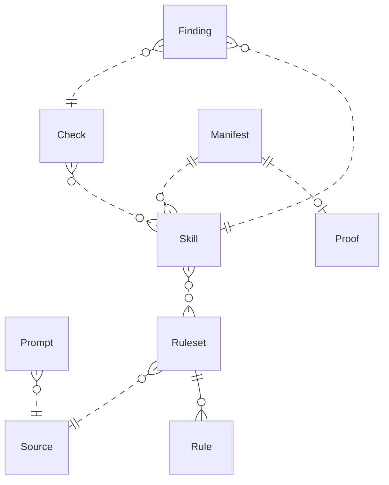

{/* Generated by `modelith render`. Do not edit by hand; edit the .modelith.yaml source and re-render. */}

# Skillet Domain Model

The shared domain behind the `github.com/StevenACoffman/skillet` library: knowledge artifacts and their verification. A `Source` is distilled through a `Prompt` into a `Ruleset` of `Rules`; those inform a `Skill`; and a `Check` produces `Findings` recorded in a `Manifest` and gated by a `Proof`.

## Glossary

- **`Author`** — The person who writes a `Source` or a `Skill`. Not a system user — the human whose expertise the pipeline captures.
- **`ContentHash`** — The content identity of an artifact: the first 16 hex characters of its sha256 digest, identical across every skillet tool.
- **`Diagnostic`** — A static statement about an artifact — severity, location, message. This is exactly what a `Finding` is in skillet.
- **`Frontmatter`** — The YAML head of a `Skill`, delimited by "---" lines, carrying its name and description.
- **`Hypothesis`** — An adjudication claim that only counts once an artifact is run to confirm it (the agentic-dev-harness sense). A `Finding` here is deliberately a `Diagnostic`, never a `Hypothesis`.
- **`RedLight`** — Wording or a path that binds a `Skill` to a single runtime; the neutrality scan flags it so other runtimes still accept the `Skill`.
- **`Reviewer`** — The person or cold agent that runs a `Check` over a `Skill` and reads its `Findings`.

## Enums

### `CheckOp`

The deterministic operation a `Check` performs on output.

| Value             | Definition                                       |
| ----------------- | ------------------------------------------------ |
| `section_present` | A named section heading exists and is non-empty. |
| `contains`        | The output contains a required phrase.           |
| `tool_called`     | A named tool was invoked.                        |
| `max_chars`       | The output is at most N characters.              |
| `min_chars`       | The output is at least N characters.             |

### `FindingSeverity`

The weight of a `Finding`.

| Value     | Definition                                      |
| --------- | ----------------------------------------------- |
| `error`   | A blocking defect the `Reviewer` must resolve.  |
| `warning` | An advisory gap that does not block on its own. |

### `RuleLevel`

Where a `Rule` applies.

| Value    | Definition                                             |
| -------- | ------------------------------------------------------ |
| `CODE`   | Expression, function, or module-level code pattern.    |
| `ARCH`   | System structure, service boundaries, data flow.       |
| `METHOD` | Process or workflow — testing, deployment, sequencing. |

### `RuleSeverity`

How strictly a `Rule` is enforced.

| Value      | Definition                                              |
| ---------- | ------------------------------------------------------- |
| `MUST`     | Block on violation; never generate the counter-example. |
| `SHOULD`   | Flag with justification; avoid in generation.           |
| `CONSIDER` | Raise only when asked; prefer but do not enforce.       |

## Entities

### `Check`

A deterministic verification operation applied to a `Skill` or model output. It names the artifact that would confirm it, so a `Finding` can be re-run rather than trusted on its text.

**Relationships**

- `Skill` — n:n — referenced — The `Skills` it verifies

**Attributes**

| Name  | Type    | Description |
| ----- | ------- | ----------- |
| `op`  | CheckOp |             |
| `arg` | string  |             |

**Actions:** `run`

**Invariants**

- **check-names-an-artifact** — A `Check` names the artifact whose run confirms or clears it.

### `Finding`

A static `Diagnostic` a `Check` produces about a `Skill`: a severity, a category, a location, and a message. It is not an adjudication `Hypothesis` — it is resolved by re-running its `Check`.

**Relationships**

- `Check` — n:1 — referenced — The `Check` that produced it
- `Skill` — n:1 — referenced — The `Skill` it flags

**Attributes**

| Name       | Type            | Description |
| ---------- | --------------- | ----------- |
| `severity` | FindingSeverity |             |
| `category` | string          |             |
| `message`  | string          |             |

**Actions**

- `raise` — preserves finding-is-a-diagnostic

**Invariants**

- **finding-is-a-diagnostic** — A `Finding` is a static `Diagnostic`, never an adjudication `Hypothesis`.
- **finding-cites-its-check** — A `Finding` cites the `Check` that produced it.

### `Manifest`

The verification record over a set of `Skills`: each skill's `ContentHash` and whether every gate passed. It is the auditable output of a verify run.

**Relationships**

- `Skill` — 1:n — referenced — The `Skills` it records
- `Proof` — 1:0..1 — referenced — The `Proof` that gates closing, if required

**Attributes**

| Name                | Type    | Description |
| ------------------- | ------- | ----------- |
| `structureVerified` | boolean |             |

**Actions**

- `build`
- `verify` — actor `Reviewer`; preserves manifest-verified-iff-all-gates-pass

**Invariants**

- **manifest-verified-iff-all-gates-pass** — A `Manifest` is marked verified only when every recorded `Skill` passes its gates.

### `Prompt`

A generated instruction that tells a model to distil one `Source` into a `Ruleset`. It is a working artifact of the pipeline, not a deliverable.

**Relationships**

- `Source` — n:1 — referenced — The `Source` this prompt distills

**Attributes**

| Name     | Type   | Description |
| -------- | ------ | ----------- |
| `target` | string |             |

**Actions:** `generate`

**Invariants**

- **prompt-targets-one-source** — A `Prompt` distills exactly one `Source`.

### `Proof`

A content-addressed manifest of artifacts that must exist and match their `ContentHash` before a `Manifest` can close — the no-proof-no-close gate.

**Attributes**

| Name            | Type    | Description                                              |
| --------------- | ------- | -------------------------------------------------------- |
| `hashAlgorithm` | string  |                                                          |
| `artifactCount` | integer | _Derived:_ The number of artifacts the `Proof` declares. |

**Actions**

- `create`
- `verify` — preserves proof-artifacts-hash-match

**Invariants**

- **proof-artifacts-hash-match** — Every artifact a `Proof` declares exists and matches its recorded `ContentHash`.

### `Rule`

One atomic, mechanically applicable constraint: an imperative, a rationale naming the failure mode, and a ✓/✗ example pair. It belongs to exactly one `Ruleset`.

**Attributes**

| Name       | Type         | Description |
| ---------- | ------------ | ----------- |
| `severity` | RuleSeverity |             |
| `level`    | RuleLevel    |             |
| `section`  | string       |             |

**Actions:** `create`

**Invariants**

- **rule-has-severity-and-level** — Every `Rule` carries a severity and a level.
- **rule-belongs-to-one-ruleset** — Every `Rule` belongs to exactly one `Ruleset`.

### `Ruleset`

A distilled set of executable `Rules` derived from a single `Source`. Loaded as context, it overrides a model's defaults where the `Source` speaks.

**Relationships**

- `Source` — n:1 — referenced
- `Rule` — 1:n — owned — The `Rules` it contains

**Attributes**

| Name    | Type   | Description |
| ------- | ------ | ----------- |
| `scope` | string |             |

**Actions**

- `synthesize`
- `refine` — actor `Reviewer`; preserves ruleset-derives-from-one-source

**Invariants**

- **ruleset-derives-from-one-source** — A `Ruleset` derives from exactly one `Source`.

### `Skill`

A SKILL.md artifact: `Frontmatter` plus a Markdown body, authored to be installable by any agent runtime. Its `ContentHash` gives it a stable identity across tools.

**Relationships**

- `Ruleset` — n:n — referenced — The `Rulesets` compiled into this skill, if any

**Attributes**

| Name          | Type    | Description |
| ------------- | ------- | ----------- |
| `name`        | string  |             |
| `bytes`       | integer |             |
| `contentHash` | string  |             |

**Actions**

- `lint` — actor `Reviewer`
- `scan`
- `verify` — preserves skill-runtime-neutral

**Invariants**

- **skill-has-frontmatter** — A `Skill` has `Frontmatter` with a name and a description.
- **skill-runtime-neutral** — A `Skill` contains no `RedLight` wording, so any runtime accepts it.

### `Source`

A prose document of domain expertise — a blog post, article, or paper — that the pipeline distills. A `Source` is the authority its `Ruleset` may not contradict; when it disagrees with a model's defaults, the `Source` wins.

**Attributes**

| Name    | Type   | Description |
| ------- | ------ | ----------- |
| `title` | string |             |

**Actions**

- `distill` — actor `Author`; preserves source-is-authoritative

**Invariants**

- **source-is-authoritative** — A `Ruleset` derived from a `Source` never asserts beyond what the `Source` supports.

## Relationships

## Invariants

- **hash-identity-frozen** — `ContentHash` is the first 16 hex characters of a sha256 digest and is byte-identical across every skillet tool, so an artifact has one identity everywhere.
- **neutrality-is-shared** — The `RedLight` set that defines runtime-binding is byte-identical across tools, so they never disagree about whether a `Skill` is runtime-neutral.

## Scenarios

### Distill a Source into a Ruleset

An `Author` turns prose expertise into executable constraints: a `Prompt` is generated for the `Source`, a model distils it into a `Ruleset`, and each `Rule` gets a severity and level.

**Actors:** Author

**Steps**

1. A `Prompt` is generated for the `Source`
2. A model distils the `Source` into a `Ruleset`
3. Each `Rule` in the `Ruleset` is given a severity and a level

**Invariants touched**

- **source-is-authoritative** — A `Ruleset` derived from a `Source` never asserts beyond what the `Source` supports.
- **ruleset-derives-from-one-source** — A `Ruleset` derives from exactly one `Source`.
- **rule-has-severity-and-level** — Every `Rule` carries a severity and a level.

### Verify a Skill Tree

A `Reviewer` runs each `Check` over every `Skill`, first scanning for `RedLight` wording; the `Findings` are recorded in a `Manifest` that is marked verified only if nothing blocking remains.

**Actors:** Reviewer

**Steps**

1. Each `Skill` is scanned for `RedLight` wording
2. A `Reviewer` runs each `Check` and collects its `Findings`
3. The `Findings` are recorded in a `Manifest`

**Invariants touched**

- **skill-runtime-neutral** — A `Skill` contains no `RedLight` wording, so any runtime accepts it.
- **finding-is-a-diagnostic** — A `Finding` is a static `Diagnostic`, never an adjudication `Hypothesis`.
- **manifest-verified-iff-all-gates-pass** — A `Manifest` is marked verified only when every recorded `Skill` passes its gates.

### Prove and Close

Before a `Manifest` closes, a `Proof` is created over the declared artifacts and each is re-hashed to its `ContentHash`; any mismatch blocks the close.

**Actors:** Reviewer

**Steps**

1. A `Proof` is created over the artifacts a `Manifest` declares
2. Each artifact is re-hashed and compared to its `ContentHash`
3. The `Manifest` closes only when every artifact matches

**Invariants touched**

- **proof-artifacts-hash-match** — Every artifact a `Proof` declares exists and matches its recorded `ContentHash`.
- **manifest-verified-iff-all-gates-pass** — A `Manifest` is marked verified only when every recorded `Skill` passes its gates.
